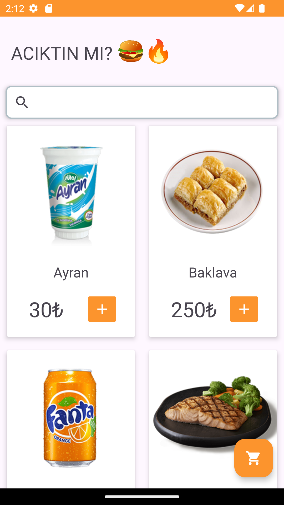
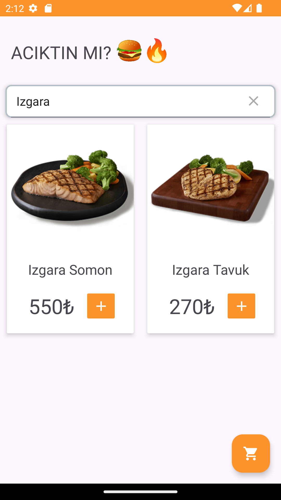
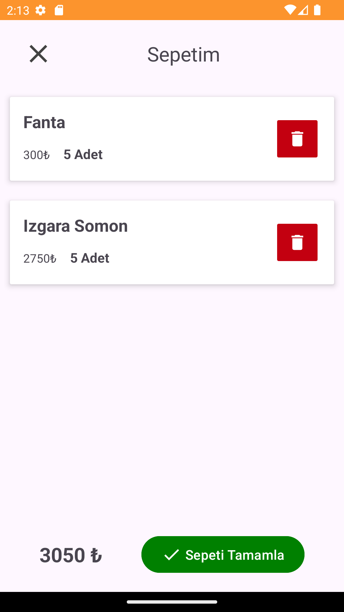
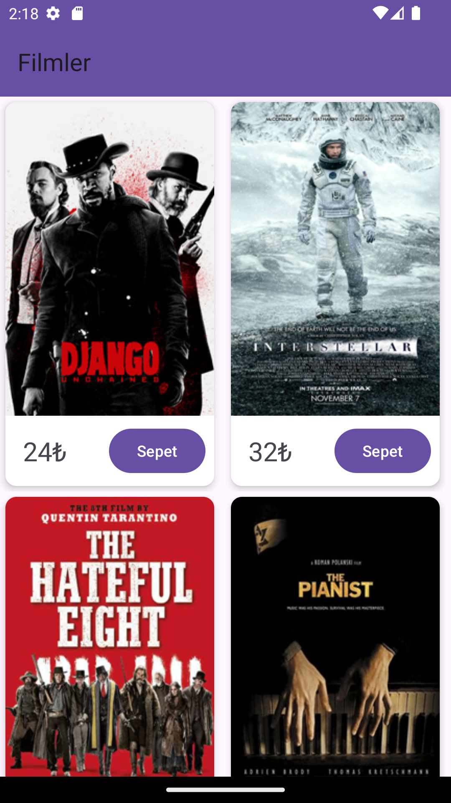
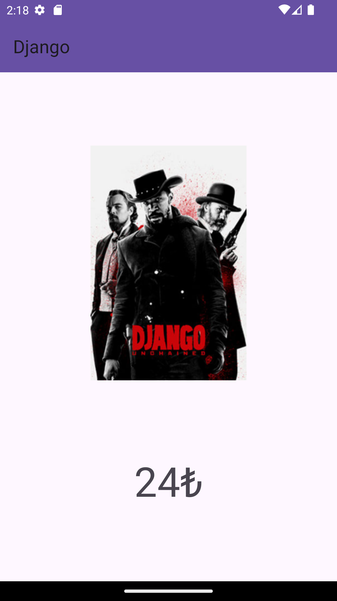
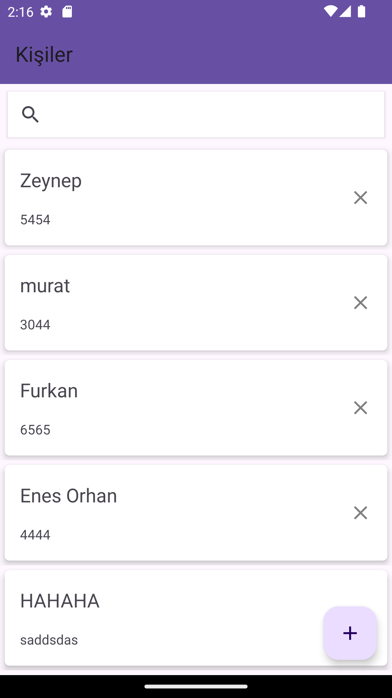
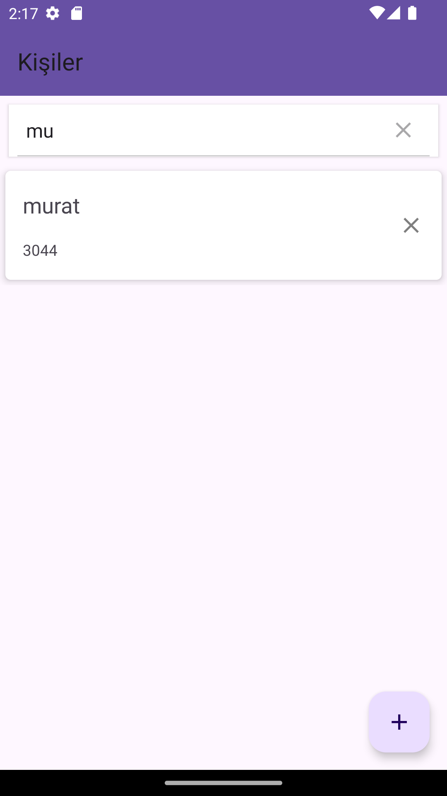
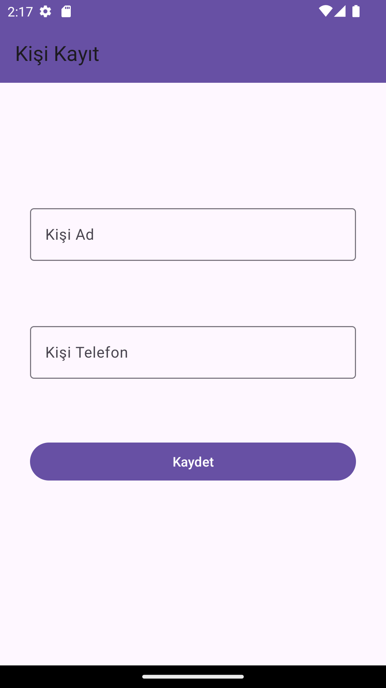
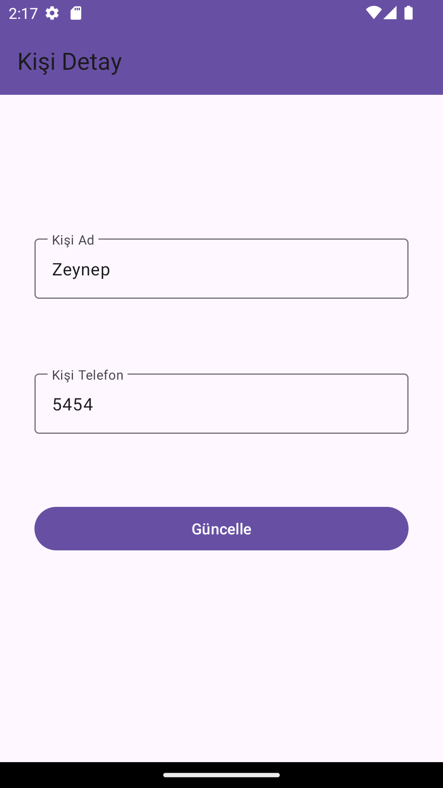
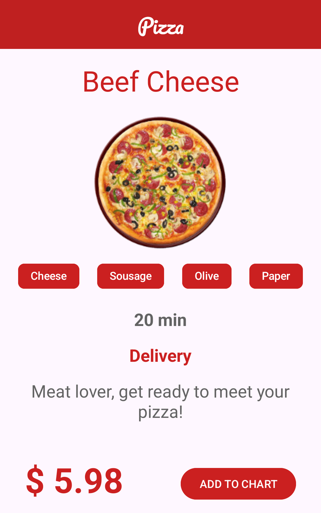

# Kotlin Projects

This repository contains several projects developed using Kotlin. Each project utilizes specific technologies and tools. Below are the detailed descriptions of each project, the technologies used, and the screenshots of the applications.

---

## 1. Food Ordering App
**Technologies Used:**  
- MVVM  
- Hilt  
- Retrofit  
- Glide

**Screenshots:**  
|  |  |
|  |  |
|  |

---

## 2. Movie App
**Technologies Used:**  
- MVVM  
- Hilt  
- Room  
- Retrofit  
- Firebase  
- Glide

**Screenshots:**  
|  |  |

---

## 3. Contacts App
**Technologies Used:**  
- MVVM  
- Hilt  
- Room  
- Retrofit  
- Firebase

**Screenshots:**  
|  |  |

|  |  |

---

## 4. Pizza Design App
**Technologies Used:**  
- MVVM  
- Glide

**Screenshots:**  
|  | 
